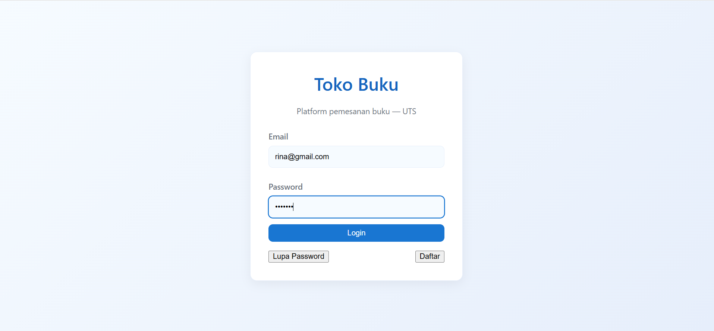
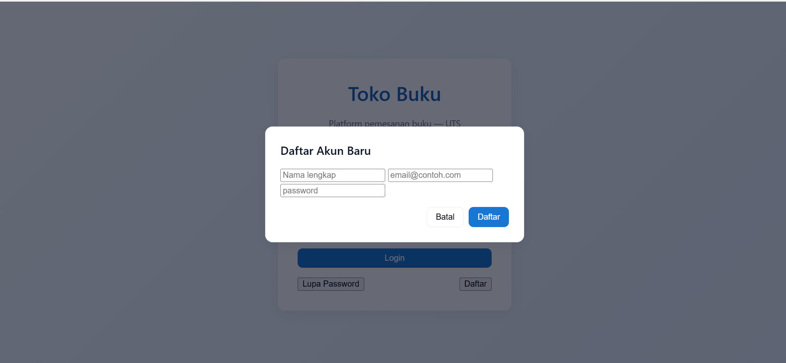
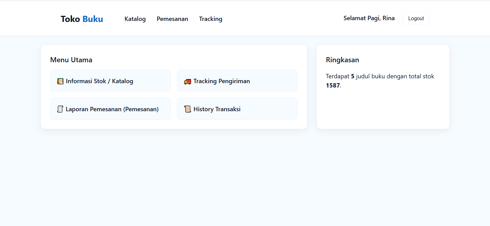
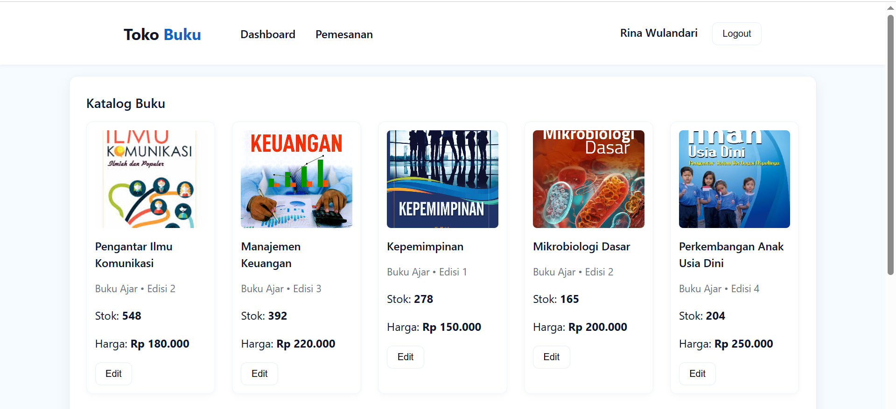
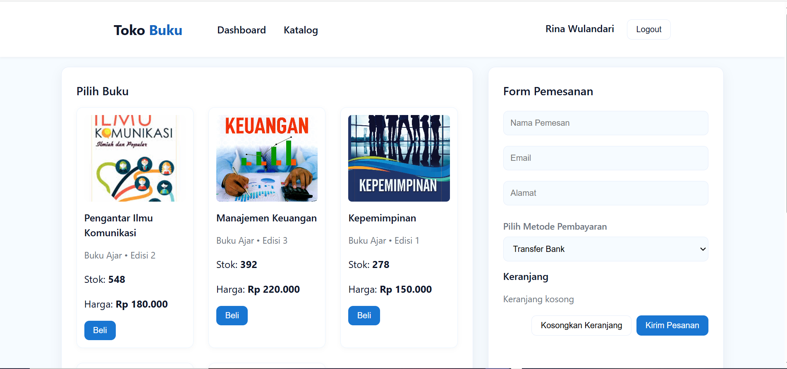
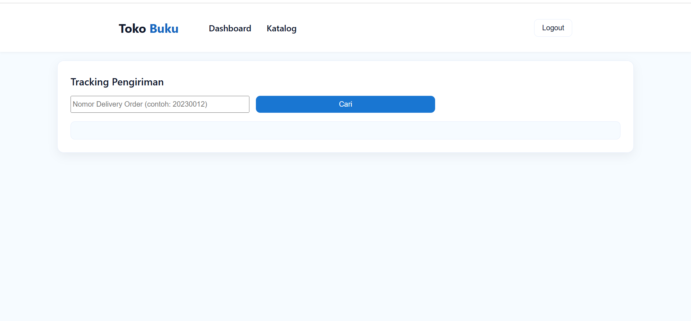

# 🏫 UTS Pemrograman Web 1 — Website Toko Buku Online

Nama: Muhammad Aziz Tri Ramadhan

NIM: 312410380

Kelas: TI.24.A3

Mata Kuliah: Pemrograman Web 1

Dosen Pengampu: Agung Nugroho, S.Kom., M.Kom.

Universitas: Universitas Pelita Bangsa

## 🧩 Deskripsi Proyek

Website ini merupakan implementasi dari **Soal UTS Pemrograman Web 1**, dengan tema utama **Toko Buku Online**. Proyek ini dibuat menggunakan **HTML, CSS, dan JavaScript murni**, tanpa framework tambahan. Tujuan utama dari pembuatan website ini adalah untuk mempraktikkan konsep dasar:

* Struktur halaman web dengan HTML
* Pemisahan tampilan dengan CSS
* Manipulasi data dan DOM menggunakan JavaScript
* Penggunaan `localStorage` sebagai penyimpanan sementara data pengguna dan pesanan

Tampilan website menggunakan warna **biru dan putih** agar terkesan modern, bersih, dan mudah dibaca.

---

## 🧱 Struktur Folder

```
project-root/
├── css/
│   └── styles.css           # File CSS utama untuk semua halaman
├── js/
│   └── app.js               # Script JS global untuk modal dan utilitas umum
├── img/                     # Berisi semua gambar cover buku (hasil extract dari img.zip)
├── data.js                  # Sumber data: pengguna, katalog buku, dan tracking
├── login.html               # Halaman login pengguna
├── dashboard.html           # Halaman utama setelah login
├── stok.html                # Halaman katalog & tambah stok buku
├── checkout.html            # Halaman pemesanan & checkout
├── tracking.html            # Halaman tracking pengiriman
└── README.md                # Dokumentasi proyek ini
```

---

## ⚙️ Fitur Utama Website

### 1️⃣ Login & Registrasi Simulasi

* Pengguna dapat login menggunakan akun yang sudah ada di `data.js`.
* Validasi dilakukan dengan mencocokkan email dan password.
* Setelah login, data pengguna disimpan di `localStorage` agar bisa diakses di halaman lain.
* Fitur **lupa password** dan **daftar akun baru** disimulasikan menggunakan modal popup.

### Capture
#### Login



#### Registrasi



#### Lupa Password


### 2️⃣ Dashboard

* Setelah login, pengguna diarahkan ke **dashboard.html**.
* Menampilkan **greeting otomatis** berdasarkan waktu (pagi, siang, sore, malam).
* Memuat nama pengguna yang sedang login.
* Menyediakan navigasi cepat ke halaman stok, checkout, dan tracking.

### Capture




### 3️⃣ Katalog Buku (stok.html)

* Menampilkan tabel berisi daftar buku dari variabel `dataKatalogBuku`.
* Setiap buku menampilkan: kode, cover, nama, jenis, edisi, stok, dan harga.
* Dapat menambahkan buku baru melalui form tanpa reload halaman (menggunakan manipulasi DOM).

### Capture



### 4️⃣ Pemesanan & Checkout (checkout.html)

* Pengguna dapat memilih buku dari dropdown yang diambil dari `dataKatalogBuku`.
* Jumlah item bisa diatur sebelum dimasukkan ke keranjang.
* Semua item yang ditambahkan ke keranjang ditampilkan dalam tabel dengan opsi hapus.
* Setelah mengisi data pemesan dan metode pembayaran, sistem akan membuat nomor **Delivery Order (DO)** secara otomatis.
* Pesanan disimpan ke `localStorage` untuk simulasi penyimpanan database.

### Capture



### 5️⃣ Tracking Pengiriman (tracking.html)

* Pengguna dapat mencari status pengiriman berdasarkan nomor DO.
* Data diambil dari objek `dataTracking` di `data.js`.
* Hasil pencarian menampilkan nama penerima, status, ekspedisi, tanggal kirim, dan riwayat perjalanan barang.

### Capture



---

## 🎨 Desain & Tampilan

* Warna dominan **biru (#2b6cb0)** dan **putih**.
* Desain menggunakan konsep **clean minimalis**.
* Layout menggunakan **Flexbox** dan **CSS Grid**.
* Semua tombol, input, dan elemen UI diseragamkan agar konsisten di setiap halaman.

---

## 🧠 Teknologi yang Digunakan

| Teknologi            | Fungsi                                                            |
| -------------------- | ----------------------------------------------------------------- |
| **HTML5**            | Struktur halaman utama                                            |
| **CSS3**             | Desain dan tata letak halaman                                     |
| **JavaScript (ES6)** | Logika interaktif, manipulasi DOM, dan penyimpanan data sementara |
| **LocalStorage**     | Menyimpan sesi pengguna dan riwayat pemesanan                     |

---

## ▶️ Cara Menjalankan Program

1. Pastikan semua file telah diekstrak dalam satu folder.
2. Pastikan file `data.js` dan folder `img/` ada di root project.
3. Buka file **`login.html`** menggunakan browser (klik dua kali atau gunakan ekstensi Live Server di VSCode).
4. Login menggunakan data contoh dari `data.js`, seperti:

   ```
   Email: rina@gmail.com
   Password: rina123
   ```
5. Setelah berhasil login, Anda akan diarahkan ke dashboard.
6. Dari dashboard, Anda bisa mengakses semua fitur lainnya.
